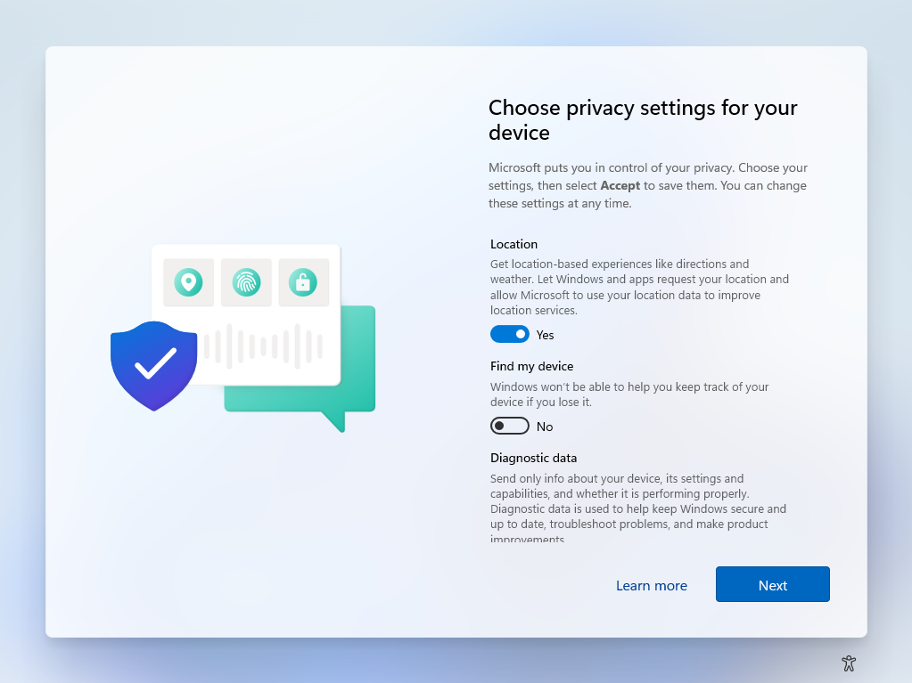

## Software list
Download [7-Zip](https://7-zip.org/download.html) <br />
```powershell
# Make sure that executable name is correct
msiexec.exe /i "7z2301-x64.msi" /quiet /qn /norestart
```
Download [Adobe Acrobat Reader DC](https://get.adobe.com/reader/enterprise/) <br />
```powershell
# Make sure that executable name is correct
cmd /c AcroRdrDC2300320244_en_US.exe /sAll /rs /msi EULA_ACCEPT=YES
```
## Windows configuration list
Disable "Privacy Experience" <br />

```powershell
reg add HKLM\SOFTWARE\Policies\Microsoft\Windows\OOBE /v DisablePrivacyExperience /t REG_DWORD /d 1
```
